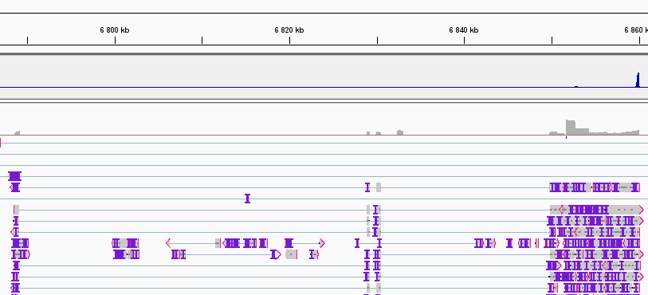

# Nanopore Sequencing (ifpan-janrod-nanopore)

#### Project logline (technique, organism, tissue type)
Mice C57BL/6N (breeding); coronal sections

Samples:
- TH\_7570 – thalamus, female
- TH\_7566 – thalamus, male
- STR\_7570 – striatum, female
- STR\_7566 – striatum, male

Thalamus: 4 sections 200μm, isolated with a needle  
Striatum: 3 sections 200μm, a whole section


## Methods
This sections should be a description of preprocessin and analysis ready to be included in the publication


## Preprocessing
Each sample has two directories (`{date?}\_{time?}\_{position}\_{flow\_cell\_id}\_{protocol\_run\_id}`):
- 20220224\_146\_5C\_PAK53731\_3f1a4734
- 20220303\_0915\_2B\_PAK51151\_6830aff81

Each directory contains `fastq_pass` directory with fastq files (`...\_{acquisition\_run\_id}\_{nr}.fastq.gz`), e.g.:
- PAK53731\_pass\_barcode45\_51d07536\_1000.fastq.gz
- PAK53731\_pass\_barcode45\_51d07536\_1001.fastq.gz

### Organize files for an analysis
All fastq files in each group striatum and thalamus were merged.
`preprocessing/merge_fastq_copy_summary_to_data.sh`

### QC
For QC MinIOINQC v1.4.2 was used (https://github.com/roblanf/minion\_qc/releases/tag/1.4.2).
Docker container named `minion_qc` was based on r-base:4.1.3 and all needed packages were installed.
```bash
docker container exec --user "$(id -u):$(id -g)" minion_qc Rscript /home/ippas/ifpan-janrod-nanopore/preprocessing/MinIONQC-v1.4.2.R -p 8 -i /home/ippas/ifpan-janrod-nanopore/data/ -o /home/ippas/ifpan-janrod-nanopore/results/minion_qc/
```

MultiQC
```bash
docker run --name multiqc --rm -v $PWD:$PWD --user "$(id -u):$(id -g)" ewels/multiqc /home/ippas/ifpan-janrod-nanopore/results/minion_qc/ -o /home/ippas/ifpan-janrod-nanopore/results/minion_qc/
```

### Alignment
Two programs were used for read alignment. Output _sam_ files were sorted and indexed by samtools afterwards.

#### Alignment to a reference genome mm10

##### Minimap2 (v. 2.24)
(https://github.com/lh3/minimap2)

`-N 10` option is recommended by NanoCount.

```bash
minimap2 -ax splice -uf -k14 -N 10 -t 22 raw/refdata-gex-mm10-2020-A/fasta/genome.fa data/str/str.fastq.gz > data/str/str.sam
minimap2 -ax splice -uf -k14 -N 10 -t 22 raw/refdata-gex-mm10-2020-A/fasta/genome.fa data/th/th.fastq.gz > data/th/th.sam

samtools sort --threads 23 data/str/str.sam > data/str/str.bam
samtools sort --threads 23 data/th/th.sam > data/th/th.bam
samtools index data/str/str.bam
samtools index data/th/th.bam
```

##### GraphMap2 (v. 0.6.4)
(https://github.com/lbcb-sci/graphmap2)

Graphmap uses a lot memory and it wasn't possible to align a whole sample (STR or TH).
```bash
graphmap2-v0.6.4 align -x rnaseq -t 22 -r raw/refdata-gex-mm10-2020-A/fasta/genome.fa -d data/str/str-66-02.fastq.gz -o data/str/str-66-02.sam
```

#### Alignment to a transcriptome
Transcriptome downloaded from `http://ftp.ensembl.org/pub/release-102/fasta/mus_musculus/cdna/Mus_musculus.GRCm38.cdna.all.fa.gz`

```bash
minimap2 -ax map-ont -p 0 -N 10 -t 22 raw/Mus_musculus.GRCm38.cdna.all.fa.gz data/str/str.fastq.gz > data/str/str-cdna.sam
minimap2 -ax map-ont -p 0 -N 10 -t 22 raw/Mus_musculus.GRCm38.cdna.all.fa.gz data/th/th.fastq.gz > data/th/th-cdna.sam
```

## Analysis

An analysis shows that there's highly abundant a 'novel' transcript with a very long UTR at the end (10kb) - 'a cat with a tail'. It has 4 exons and spans chr10:6788570-6850572 (+) *plus* a long UTR. This variant is present in RefSeq database (without long UTR) but not in Ensembl database.



There's some discrapency between aligned reads and reference transcripts, so expression levels assigned to transcripts are not always correct - especially for Oprm1.

### Expression levels

Nanopore reads where aligned to GRCm38\_102/mm10 transcriptome (cDNA sequences from Ensamble database, version 102) with minimap2 (v. 2.24) sequence alignment program. Transcripts abundance of aligned sequences were estimated by NanoCount (v1.0.0.post6) and reported as TPM. Threshold for relevant abundance was set at 2TPM.

The end positions of abundant transcripts (considering the transcript strand) were utilized as markers of peaks.

#### NanoCount (v1.0.0.post6)

```bash
NanoCount -i data/str/str.bam -o data/str/str-transcript_counts.tsv
NanoCount -i data/th/th.bam -o data/th/th-transcript_counts.tsv
```
A very low number of **valid alignments** (around 200, where 16mln and 15mln were discarded due to a negative strand and invalid 3 prime end respectively).

```bash
NanoCount -i data/str/str-cdna.bam -o data/str/str-cdna-transcript_counts.tsv
NanoCount -i data/th/th-cdna.bam -o data/th/th-cdna-transcript_counts.tsv
```
Number of valid alignments is ~35mln (~68mln and ~32mln discarded).

#### Cufflinks (v2.2.1)
Cufflinks doesn't work:

`BAM record error: found spliced alignment without XS attribute.` _AS is the alignment score, and XS is the "suboptimal alignment score", essentially a secondary alignment_.
